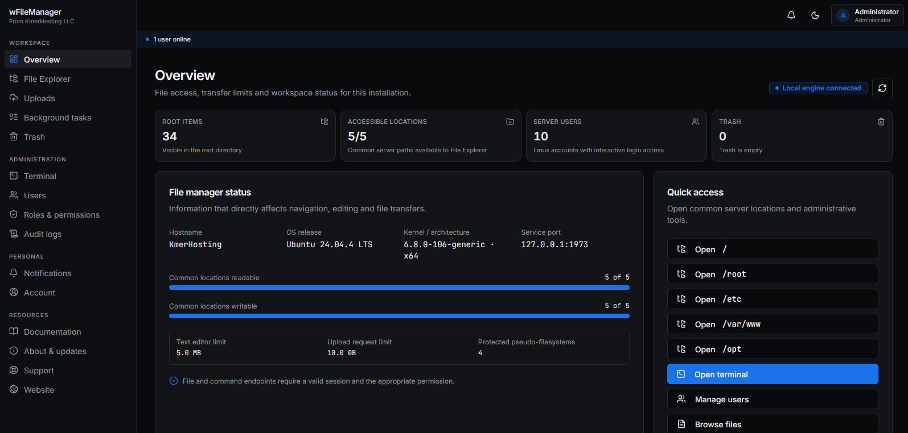
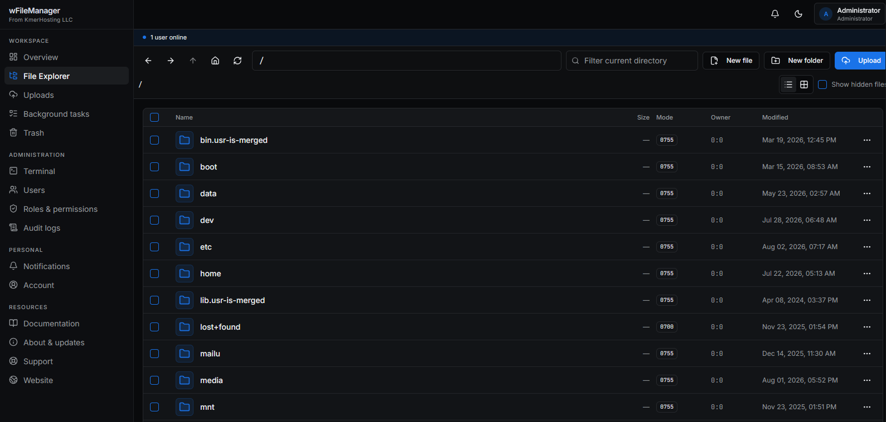
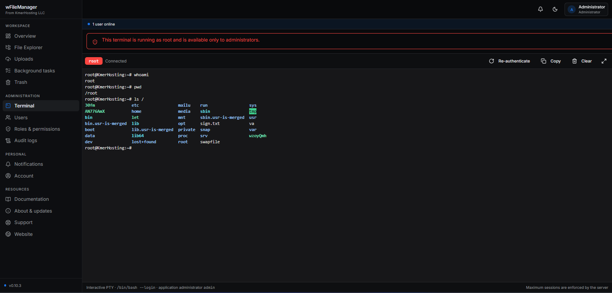
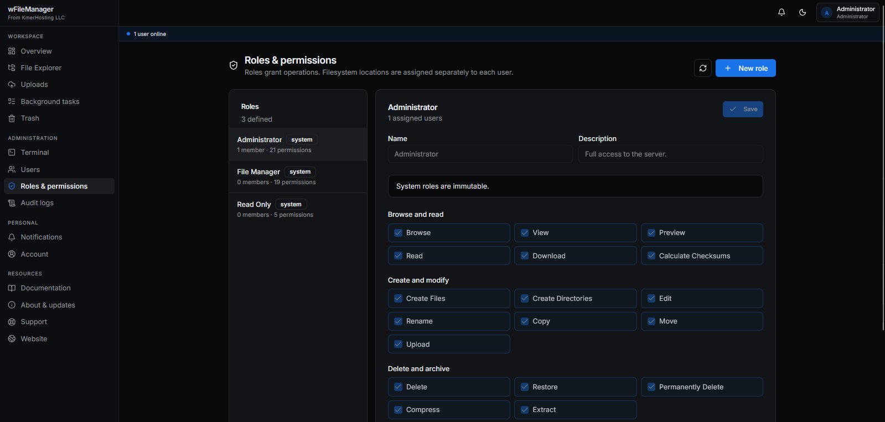

<h1 align="center">wFileManager</h1>

<p align="center">
  A secure, open source file manager and server workspace for Linux.
</p>

<p align="center">
  
  
  
  
  
  
  
</p>

wFileManager provides a real filesystem explorer, uploads, downloads, guarded archives, trash,
application users and roles, notifications, verified updates and an administrator-only root
terminal. It is fully open source and does not require a license key or hosted data service.

## Install

Requirements: Ubuntu 20.04 LTS or newer, root access, systemd, a public IPv4 address and a domain
whose A record points to the server.

```bash
curl -fsSL https://igihzeyfgwhnuiflamvn.supabase.co/storage/v1/object/public/releases.kmerhosting.com/wfilemanager/install.sh | sudo bash
```

The installer verifies DNS, configures Nginx and HTTPS, installs a verified release, then opens
`/setup` to create the first administrator.

Application state stays on the machine at:

```text
/var/lib/wfilemanager/wfilemanager.db
```

Back up this database together with the files, websites and databases managed through the app.

## Screenshots

### Overview



### File explorer



### Root terminal



### Roles and permissions



The setup screenshot will be added separately.

## Operations

```bash
sudo systemctl status wfilemanager.service --no-pager
sudo journalctl -u wfilemanager.service -f
curl -fsS http://127.0.0.1:1973/api/health
sudo wfilemanager-reset-admin-password
sudo systemctl start wfilemanager-updater@install.service
sudo systemctl start wfilemanager-updater@rollback.service
sudo wfilemanager-uninstall
```

Updates are verified, built separately and activated atomically. A failed health check automatically
restores the previous release.

## Development

```bash
bun install --frozen-lockfile
bun run dev
```

Useful checks:

```bash
bun run typecheck
bun run test
bun run build
bun run lint
```

## License

[MIT](LICENSE). Security reports: `support@kmerhosting.com`.
